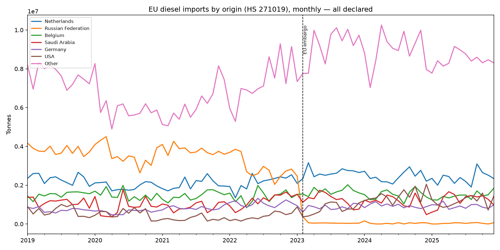
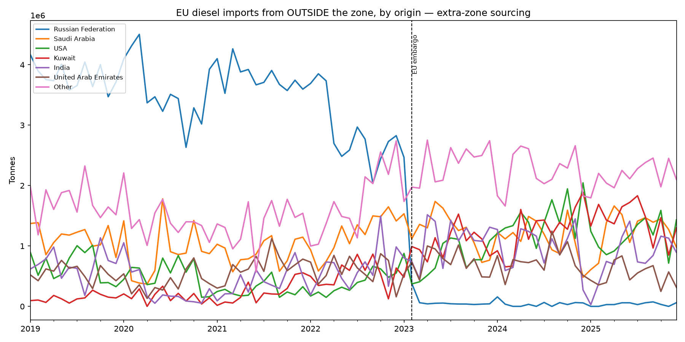

# EU Diesel Rerouting — After the Russian Embargo

Data pipeline and analysis of the reshuffling of EU diesel imports after the
2023 EU embargo on Russian refined petroleum products.

## The story

Before 2022, Russia supplied roughly half of the EU's imported diesel — short
shipping distances, established logistics, a crude blend well suited to
distillate production. The EU embargo on Russian refined products, effective
5 February 2023, cut that supply overnight. Diesel didn't disappear from the
world market — it got rerouted: the Gulf (Saudi Arabia, UAE — new mega
refineries), the US and India (which buys discounted Russian crude, refines
it and legally re-sells the diesel to Europe) stepped in, at the cost of much
longer shipping routes.

This project quantifies that reshuffling using public UN Comtrade trade data.

## What this project answers

1. **Origin shift** — who supplied EU diesel in 2019, who supplies it now
   and how fast the switch happened, month by month.
2. **Price vs. flows** — did import volumes respond to the diesel refining
   margin (crack spread) spike after the embargo and with what lag?
3. **Distance** — how much did the average shipping distance for EU diesel
   imports increase (tonne-miles), given the shift from nearby (Russia) to
   distant (India, Gulf, US) suppliers?

Question 1 is answered as of this writing (see `docs/`). Questions 2 and 3
are the next steps (SQL analysis phase).

## Data & methodology

- **Source**: [UN Comtrade](https://comtrade.un.org), free API tier.
- **Commodity**: HS code `271019` — medium petroleum distillates. The closest
  available proxy for diesel; also includes some heating oil and jet fuel
  blends depending on national classification. Diesel dominates this code for
  European flows, but the exact split isn't isolated in Comtrade data — a
  documented approximation, not a precision measure.
- **Flow direction**: **imports**, declared by the receiving country — not
  exports declared by the origin. Two reasons: Russia stopped publishing
  detailed export statistics after 2022 (export-side data is simply missing
  for the country at the center of this story) and import declarations are
  generally more reliable (customs and VAT are charged on imports, so they're
  checked more closely than exports).
- **Reporting countries**: EU-27 + UK + Norway + Switzerland (30 countries).
  Scope follows the physical diesel market, not the EU's legal borders — the
  UK shares the same supply routes and had its own near-simultaneous embargo;
  Norway/Switzerland are included for geographic completeness (marginal
  volume impact).
- **Period**: January 2019 – December 2025 (2026 data exists but is
  incomplete — see Limitations).

## Pipeline
```
Comtrade API  ─┐
               ├─> raw JSON (data/raw/)  ─> cleaned table (data/processed/)
EIA API (WIP) ─┘          │                          │
                          │                          v
                   completeness report        DuckDB (data/diesel.duckdb)
                                                      │
                                                      v
                                              SQL analysis + charts
```

1. **Ingest** (`src/ingest_comtrade.py`) — downloads monthly import data for
   all 30 reporters, 2019–2026, one API call per (reporter, year). Idempotent:
   safe to re-run, skips files already downloaded.
2. **Verify** (`src/check_completeness.py`) — checks the downloaded files
   against the expected (reporter × year) grid: empty files, partial years,
   internal consistency (e.g. sum of partner lines vs. the reported World
   total).
3. **Transform** (`src/transform.py`) — stacks all raw files, drops
   transport/customs/consignment breakdown rows (keeps totals only, to avoid
   double counting), and separates partner-level detail from the World
   aggregate line.
4. **Enrich** (`src/reference.py`, `src/enrich.py`) — downloads the official
   Comtrade partner reference table, joins country names onto the numeric
   codes, and flags non-country aggregate codes (regional "nes" categories,
   Bunkers, Free Zones, Special Categories).
5. **Fill zeros** (`src/fill_zeros.py`) — Comtrade omits rows for zero flows
   entirely rather than writing a zero. This script reconstructs explicit
   zero rows for (reporter, partner, month) combinations that are genuinely
   zero — but only for months where the reporter is known to have published
   data (at least one other partner line exists that month). Months where a
   reporter published nothing at all (e.g. Austria) are left untouched: no
   data is invented.
6. **Load** (`src/load_duckdb.py`) — loads the cleaned table into a DuckDB
   file as a `flows` table, queryable with plain SQL.
7. **Chart** (`src/first_chart.py`) — produces the first two visuals (see
   Results).

## Repository structure
```
eu-diesel-rerouting/
├── src/
│ ├── reporters.py # EU-27+UK+NO+CH reporter code reference (hand-built, validated)
│ ├── ingest_comtrade.py # API ingestion
│ ├── test_single_call.py # one-shot ingestion test
│ ├── check_completeness.py # raw data QA report
│ ├── transform.py # stacking + double-count filtering
│ ├── reference.py # partner code reference (downloaded + cached)
│ ├── enrich.py # join partner/reporter names onto flows
│ ├── fill_zeros.py # explicit zero-flow reconstruction
│ ├── load_duckdb.py # Parquet -> DuckDB
│ └── first_chart.py # origin-share charts
├── sql/ # analytical queries (next phase)
├── docs/ # charts, methodology notes
├── data/ # raw/processed data, DuckDB file (gitignored)
├── requirements.txt
└── .env.example # COMTRADE_API_KEY, EIA_API_KEY
```

## Data quality issues found and how they were handled

This dataset required real cleaning; the issues below were found by building
consistency checks into the pipeline, not assumed:

- **Breakdown double counting**: some reporters publish both a total line and
  its breakdown by transport mode, customs regime and consignment country.
  Left unfiltered, this roughly doubled reported volumes for some countries.
  Fixed by keeping only total lines (`motCode=0`, `customsCode=C00`,
  `partner2Code=0`).
- **World-line inconsistency**: a cross-check (sum of partner-level rows vs.
  the reported World total) showed a 14% gap. Root cause: France, the UK and
  Spain sometimes publish a World line with zero weight while partner detail
  is fully populated. Partner detail is used as the source of truth; the
  World check now only applies where the World line carries a non-zero
  weight (0.000% gap on ~2,400 comparable reporter-months).
- **Austria**: publishes almost no monthly data for the study period (only
  2022 available). Excluded from the analysis. Austria is landlocked,
  sources diesel almost entirely intra-EU, and represents roughly 2% of EU
  diesel imports — its exclusion does not affect the extra-EU rerouting
  story that is the focus of this project.
- **Special/aggregate partner codes**: some import volume is declared against
  non-country codes (regional "not elsewhere specified" categories, ship
  bunkers, free zones). These are kept in totals (they represent real
  tonnage) but flagged and excluded from country-level breakdowns, so a
  bar labeled "Areas, nes" never appears next to real countries on a chart.
- **Rotterdam/Antwerp hub effect**: the Netherlands and Belgium report as
  top "origins" in the raw data, but 60% and 77% of their declared imports
  respectively originate from another reporter in this project's own
  30-country list — i.e. transit through Europe's largest oil ports, not
  production. A second chart (`extra_zone_origins.png`) sums only imports
  whose origin lies outside the 30-country zone, isolating true external
  sourcing from intra-zone redistribution. Known residual limitation: gross
  sums can in principle double-count a cargo re-declared after intra-zone
  transshipment; assumed marginal here and not corrected.
- **2026 coverage**: reporter coverage drops sharply from ~29/30 countries
  in December 2025 to 1 by June 2026 (publication lag). All analysis is cut
  at December 2025.

## Results so far




The second chart isolates external sourcing: Russia supplied 2.5–4.5 Mt/month
before the embargo and collapses to near-zero after February 2023, replaced
simultaneously by Saudi Arabia, the US, Kuwait, India and the UAE.

## Status

- [x] Data acquisition (Comtrade, 240 API calls, 0 failures)
- [x] Data quality checks and cleaning
- [x] DuckDB load
- [x] Origin-share charts (Q1 first pass)
- [ ] EIA price data ingestion
- [ ] SQL analysis: exact market-share tables, embargo transition speed
- [ ] Price/flow correlation (crack spread vs. volumes, lagged)
- [ ] Tonne-mile calculation (shipping distance impact)
- [ ] Power BI dashboard
- [ ] One-pager + methodology summary

## Limitations

- HS 271019 is a proxy for diesel, not an exact match (see Methodology).
- Import-side declarations only; export-side data for Russia is unavailable
  post-2022.
- Austria excluded (no monthly publication for most of the period).
- Some countries impute weight from value when no physical weight is
  declared (`isNetWgtEstimated` flag retained in the data).
- Gross extra-zone sourcing figures may include marginal double-counting
  from cargoes re-declared after intra-zone transshipment.

## Reproducing this project

```bash
git clone https://github.com/EliasElh/eu-diesel-rerouting
cd eu-diesel-rerouting
python -m venv .venv
.venv\Scripts\activate          # Windows
pip install -r requirements.txt
cp .env.example .env            # then fill in your Comtrade API key

python -m src.ingest_comtrade
python -m src.check_completeness
python -m src.transform
python -m src.reference
python -m src.enrich
python -m src.fill_zeros
python -m src.load_duckdb
python -m src.first_chart
```